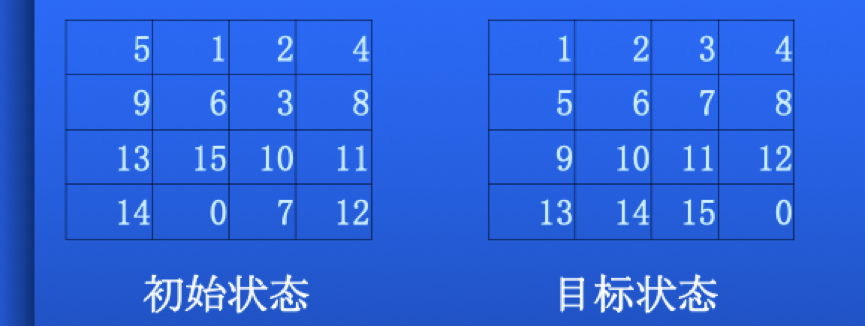

1) 算法程序: 设计一个启发函数,利用A*算法
求解15数码问题.

要求: 尽可能用与A*算法一致的思路实现算法, 力求简单明了地给出一个解. 1)打印并上交带有关键步骤说明的程序代码.2)演示运行过程

Online Demo：https://guguji5.github.io/15-puzzle-problem/

<video id="video" controls="" preload="none" poster="./pic2.ong">
    <source id="mp4" src="./15puzzle.mp4" type="video/mp4">
</video>